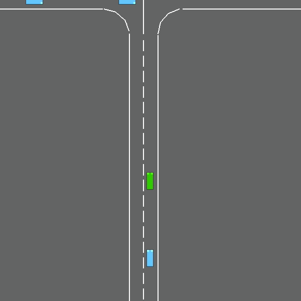

# Autonomous Intersection Navigation using Deep Reinforcement Learning

This project explores the use of **Deep Reinforcement Learning (DRL)** to train an autonomous driving agent capable of safely navigating **unsignalized four-way intersections** under varying traffic densities.

The objective is to enable an agent to make safe and efficient driving decisions in environments where multiple vehicles interact dynamically without traffic signals.

---
## Technologies Used

- Python
- PyTorch
- Deep Reinforcement Learning
- Deep Q-Network (DQN)
- Simulation-based training

---

## Problem Statement

Unsignalized intersections represent a challenging scenario for autonomous vehicles because they require:

- Understanding dynamic traffic behavior
- Predicting potential conflicts with other vehicles
- Making safe navigation decisions in real time

Traditional rule-based systems struggle with these complex interactions. This project investigates whether a **Deep Q-Network (DQN)** can learn an optimal navigation policy through simulation and reinforcement learning.

---

## Approach

The solution uses **Deep Reinforcement Learning** where an agent interacts with a simulated traffic environment and learns a driving policy through trial and error.

### Key Components

**Environment**

A custom traffic simulation environment where multiple vehicles approach and traverse an intersection.

**Agent**

A reinforcement learning agent that learns to select driving actions based on the current traffic state.

**State Representation**

The state encodes the environment surrounding the ego vehicle including:

- positions of nearby vehicles
- velocities
- relative distances
- traffic density conditions

**Actions**

The agent can choose from actions such as:

- accelerate
- decelerate
- maintain speed
- wait

**Reward Function**

The reward function encourages:

- safe navigation
- collision avoidance
- efficient intersection crossing

Penalties are applied for:

- collisions
- unsafe behavior
- inefficient delays.

---

## Learning Method

The project uses a **Deep Q-Network (DQN)** to approximate the optimal action-value function.

Training features include:

- experience replay
- epsilon-greedy exploration
- neural network-based Q-function approximation

To improve generalization, **curriculum learning** is used where the agent is first trained in simpler traffic scenarios before being exposed to higher traffic densities.

---

## System Architecture

The reinforcement learning loop follows the pipeline below:
Environment → State → DQN Agent → Action → Environment

The agent continuously interacts with the environment and updates its policy to maximize long-term rewards.

---

## Training Setup

Training was conducted across **tens of thousands of simulation episodes** with progressively increasing traffic complexity.

Training stages included:

1. Low traffic density environments
2. Moderate traffic density environments
3. High traffic density environments
4. Generalization testing across mixed traffic scenarios

---

## Results

The trained agent demonstrated strong performance in navigating intersections safely under various traffic conditions.

Key outcomes include:

- Successful navigation across multiple traffic densities
- Improved decision making through experience-based learning
- Effective collision avoidance behavior in dynamic scenarios

These results demonstrate that reinforcement learning can learn robust driving policies for complex traffic interactions.

---

## Demo

Below is a demonstration of the trained reinforcement learning agent navigating a simulated intersection.

---

## Notes

This project was developed as part of a **graduate Artificial Intelligence course project**.

The implementation code is not publicly released.

